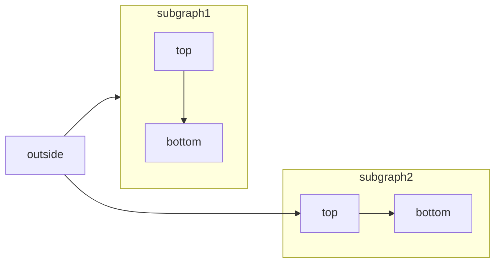

[Mermaid](https://mermaid.js.org/) ermöglicht das Erstellen von Flussdiagrammen, Sequenzdiagrammen, Gantt-Diagrammen und anderen Diagrammen mithilfe von Text und Code.

Eine vollständige Liste der unterstützten Diagrammtypen und der zugehörigen Syntax finden Sie in der [Mermaid-Dokumentation](https://mermaid.js.org/intro/).



````mdx Mermaid flowchart example

````

<div id="syntax">
  ## Syntax
</div>

Um ein Mermaid-Diagramm zu erstellen, schreiben Sie die Diagrammdefinition in einen Mermaid-Codeblock.

````mdx
```mermaid
// Ihr Mermaid-Diagrammcode hier
```
````