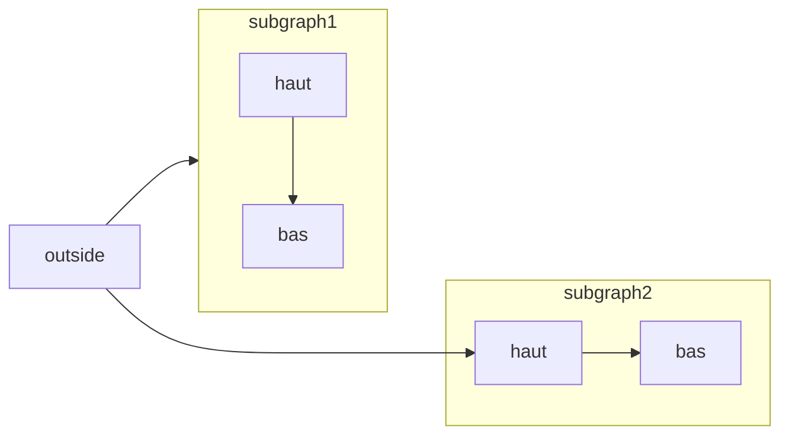
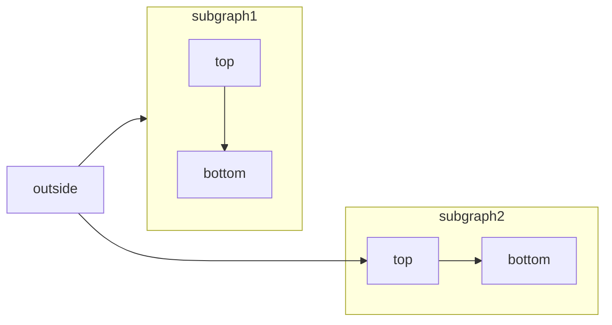

[Mermaid](https://mermaid.js.org/) permet de créer des organigrammes, des diagrammes de séquence, des diagrammes de Gantt et d’autres diagrammes à partir de texte et de code.

Pour obtenir la liste complète des types de diagrammes pris en charge et leur syntaxe, consultez la [documentation de Mermaid](https://mermaid.js.org/intro/).



````mdx Mermaid flowchart example

````


<div id="syntax">
  ## Syntaxe
</div>

Pour créer un diagramme Mermaid, écrivez la définition de votre diagramme dans un bloc de code Mermaid.

````mdx
```mermaid
// Code de votre diagramme Mermaid ici
```
````