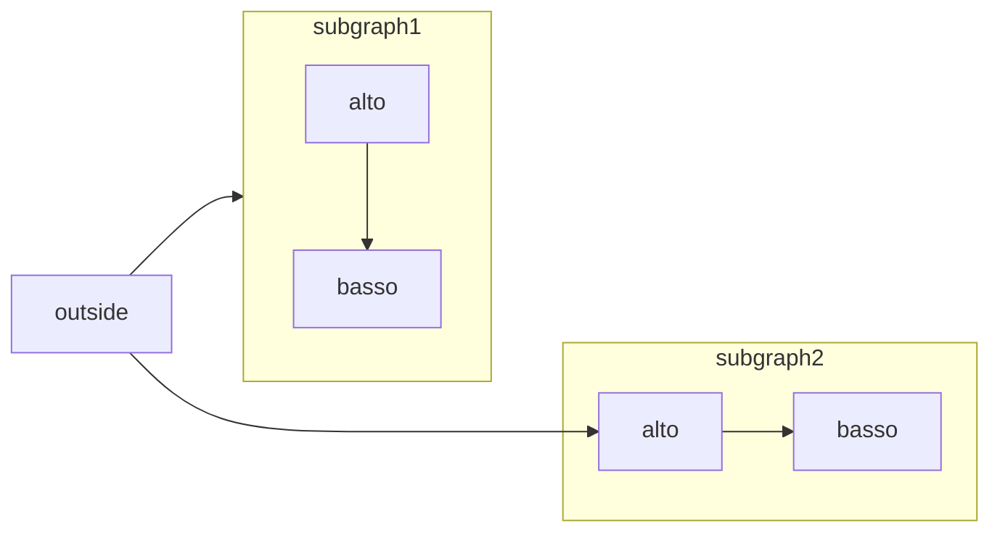
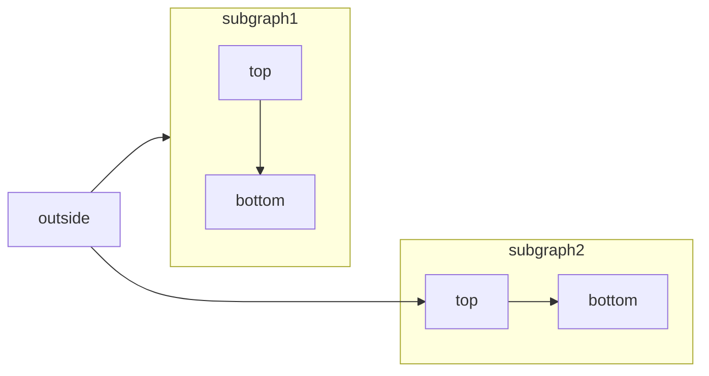

[Mermaid](https://mermaid.js.org/) permette di creare flowchart, diagrammi di sequenza, diagrammi di Gantt e altri diagrammi utilizzando testo e codice.

Per l’elenco completo dei tipi di diagrammi supportati e della relativa sintassi, consulta la [documentazione di Mermaid](https://mermaid.js.org/intro/).



````mdx Mermaid flowchart example

````


<div id="syntax">
  ## Sintassi
</div>

Per creare un diagramma Mermaid, scrivi la definizione del diagramma all’interno di un blocco di codice Mermaid.

````mdx
```mermaid
// Il codice del tuo diagramma Mermaid va qui
```
````