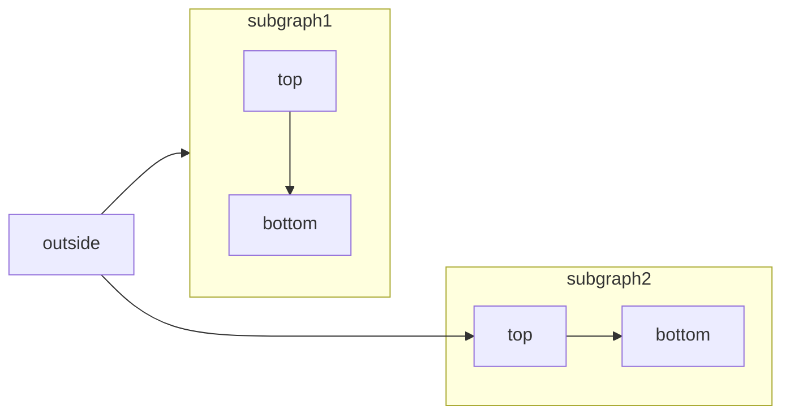

[Mermaid](https://mermaid.js.org/) permette di creare flowchart, diagrammi di sequenza, diagrammi di Gantt e altri tipi di diagrammi usando testo e codice.

Per l’elenco completo dei tipi di diagrammi supportati e della relativa sintassi, consulta la [documentazione di Mermaid](https://mermaid.js.org/intro/).

<RequestExample>

````mdx Esempio di flowchart con Mermaid

```mermaid
  flowchart LR
    subgraph subgraph1
        direction TB
        top1[top] --> bottom1[bottom]
    end
    subgraph subgraph2
        direction TB
        top2[top] --> bottom2[bottom]
    end
    %% ^ Questi sottografi sono identici, tranne che per i collegamenti:

    %% Collegamento *a* subgraph1: la direzione di subgraph1 viene mantenuta
    outside --> subgraph1
    %% Collegamento *all'interno* di subgraph2:
    %% subgraph2 eredita la direzione del grafo di livello superiore (LR)
    outside ---> top2
```
````

</RequestExample>


```mermaid
  flowchart LR
    subgraph subgraph1
        direction TB
        top1[top] --> bottom1[bottom]
    end
    subgraph subgraph2
        direction TB
        top2[top] --> bottom2[bottom]
    end
    %% ^ Questi sottografi sono identici, tranne che per i collegamenti:

    %% Collegamento *a* subgraph1: la direzione di subgraph1 viene mantenuta
    outside --> subgraph1
    %% Collegamento *all'interno* di subgraph2:
    %% subgraph2 eredita la direzione del grafo di livello superiore (LR)
    outside ---> top2
```

<div id="syntax">
  ## Sintassi
</div>

Per creare un diagramma Mermaid, scrivi la definizione del diagramma in un blocco di codice Mermaid.

````mdx
```mermaid
// Inserisci qui il codice del tuo diagramma Mermaid
```
````