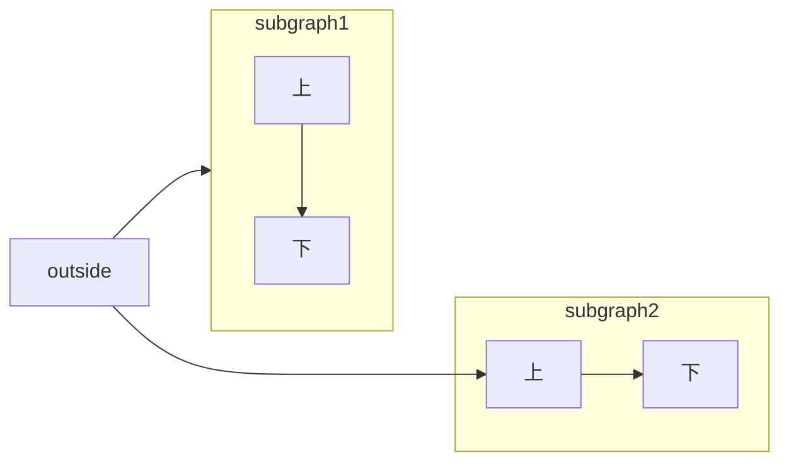
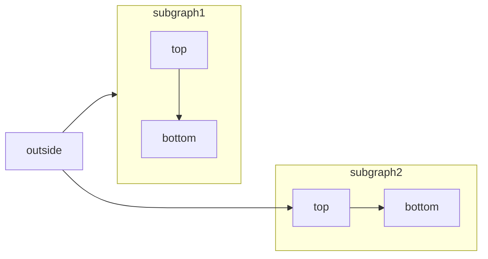

[Mermaid](https://mermaid.js.org/) を使うと、テキストとコードでフローチャート、シーケンス図、ガントチャートなどの各種ダイアグラムを作成できます。

対応しているダイアグラムの種類や構文の一覧は、[Mermaid のドキュメント](https://mermaid.js.org/intro/)を参照してください。



````mdx Mermaid flowchart example

````


<div id="syntax">
  ## 構文
</div>

Mermaid の図を作成するには、図の定義を Mermaid のコードブロック内に記述します。

````mdx
```mermaid
// ここに Mermaid の図のコードを記述
```
````