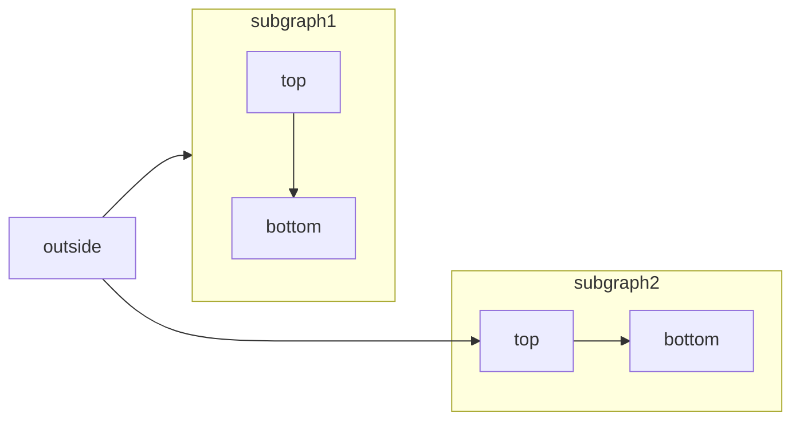

[Mermaid](https://mermaid.js.org/) を使うと、テキストとコードからフローチャート、シーケンス図、ガントチャートなどの各種ダイアグラムを作成できます。

サポートされているダイアグラムの種類と構文の一覧は、[Mermaid のドキュメント](https://mermaid.js.org/intro/)をご覧ください。


```mermaid
  flowchart LR
    subgraph subgraph1
        direction TB
        top1[top] --> bottom1[bottom]
    end
    subgraph subgraph2
        direction TB
        top2[top] --> bottom2[bottom]
    end
    %% ^ これらのサブグラフは、リンク先の違いを除いて同一です:

    %% subgraph1 へのリンク: subgraph1 の向きは維持されます
    outside --> subgraph1
    %% subgraph2 内でのリンク:
    %% subgraph2 はトップレベルグラフ（LR）の向きを継承します
    outside ---> top2
```

````mdx Mermaid のフローチャート例

```mermaid
  flowchart LR
    subgraph subgraph1
        direction TB
        top1[top] --> bottom1[bottom]
    end
    subgraph subgraph2
        direction TB
        top2[top] --> bottom2[bottom]
    end
    %% ^ これらのサブグラフは、リンク先の違いを除いて同一です:

    %% subgraph1 へのリンク: subgraph1 の向きは維持されます
    outside --> subgraph1
    %% subgraph2 内でのリンク:
    %% subgraph2 はトップレベルグラフ（LR）の向きを継承します
    outside ---> top2
```
````

<div id="syntax">
  ## 構文
</div>

Mermaid の図を作成するには、図の定義を Mermaid のコードブロック内に記述します。

````mdx
```mermaid
// ここに Mermaid の図のコードを記述
```
````