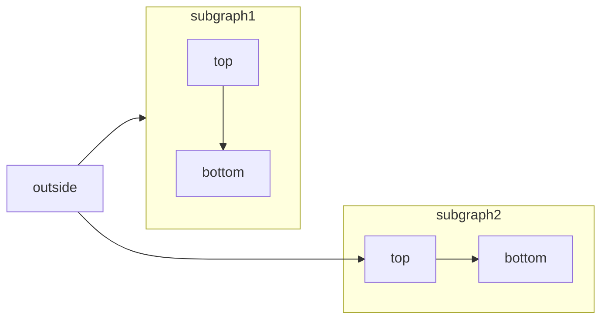

[Mermaid](https://mermaid.js.org/) を使うと、テキストとコードでフローチャート、シーケンス図、ガントチャートなどの図を作成できます。

対応している図の種類と構文の一覧は、[Mermaidのドキュメント](https://mermaid.js.org/intro/)をご参照ください。

<RequestExample>

````mdx Mermaid flowchart example

```mermaid
  flowchart LR
    subgraph subgraph1
        direction TB
        top1[top] --> bottom1[bottom]
    end
    subgraph subgraph2
        direction TB
        top2[top] --> bottom2[bottom]
    end
    %% ^ These subgraphs are identical, except for the links to them:

    %% Link *to* subgraph1: subgraph1 direction is maintained
    outside --> subgraph1
    %% Link *within* subgraph2:
    %% subgraph2 inherits the direction of the top-level graph (LR)
    outside ---> top2
```
````

</RequestExample>


```mermaid
  flowchart LR
    subgraph subgraph1
        direction TB
        top1[top] --> bottom1[bottom]
    end
    subgraph subgraph2
        direction TB
        top2[top] --> bottom2[bottom]
    end
    %% ^ These subgraphs are identical, except for the links to them:

    %% Link *to* subgraph1: subgraph1 direction is maintained
    outside --> subgraph1
    %% Link *within* subgraph2:
    %% subgraph2 inherits the direction of the top-level graph (LR)
    outside ---> top2
```

<div id="syntax">
  ## 構文
</div>

Mermaidのダイアグラムを作成するには、ダイアグラムの定義をMermaidのコードブロック内に記述します。

````mdx
```mermaid
// ここにMermaidダイアグラムのコードを記述
```
````