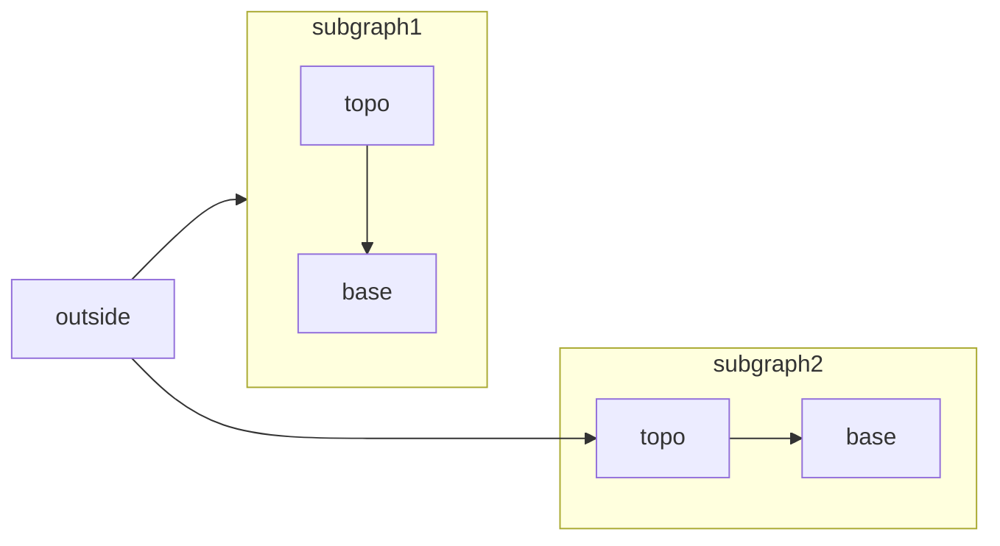

[Mermaid](https://mermaid.js.org/) permite criar fluxogramas, diagramas de sequência, gráficos de Gantt e outros diagramas usando texto e código.

Para ver a lista completa de tipos de diagramas e a sintaxe compatíveis, consulte a [documentação do Mermaid](https://mermaid.js.org/intro/).



````mdx Mermaid flowchart example

````


<div id="syntax">
  ## Sintaxe
</div>

Para criar um diagrama Mermaid, escreva a definição do seu diagrama dentro de um bloco de código Mermaid.

````mdx
```mermaid
// Seu código de diagrama Mermaid aqui
```
````