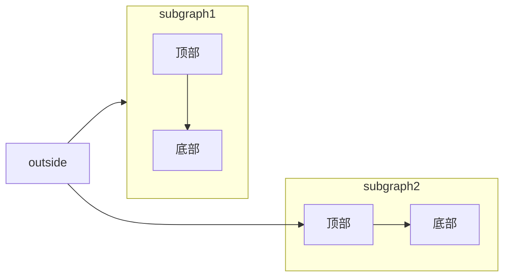

[Mermaid](https://mermaid.js.org/) 可通过文本与代码构建流程图、时序图、甘特图等各类图表。

如需查看支持的图表类型及语法的完整列表，请参阅 [Mermaid 文档](https://mermaid.js.org/intro/)。



````mdx Mermaid flowchart example

````


<div id="syntax">
  ## 语法
</div>

要创建 Mermaid 图表，请将图表定义写入一个 Mermaid 代码块中。

````mdx
```mermaid
// 在此处编写你的 Mermaid 图表代码
```
````