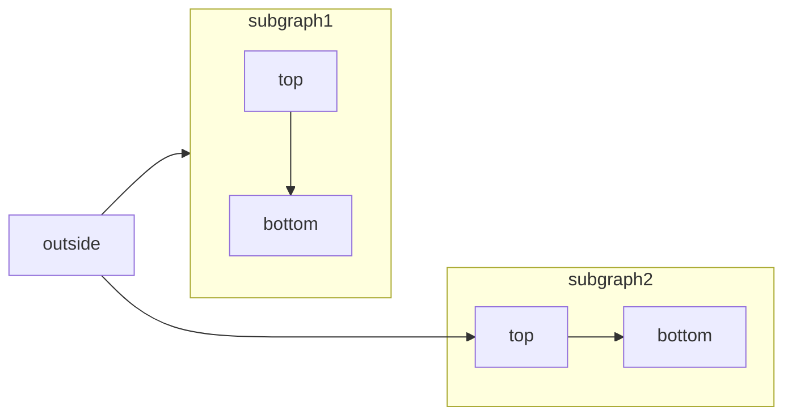

[Mermaid](https://mermaid.js.org/) 可用文本和代码创建流程图、时序图、甘特图等各类图表。

有关支持的图表类型与语法的完整列表，请参阅 [Mermaid 文档](https://mermaid.js.org/intro/)。


```mermaid
  flowchart LR
    subgraph subgraph1
        direction TB
        top1[top] --> bottom1[bottom]
    end
    subgraph subgraph2
        direction TB
        top2[top] --> bottom2[bottom]
    end
    %% ^ 这两个子图除链接不同外，其余相同：

    %% 链接到 subgraph1：保持 subgraph1 的方向
    outside --> subgraph1
    %% 在 subgraph2 内部的链接：
    %% subgraph2 继承顶层图（LR）的方向
    outside ---> top2
```

````mdx Mermaid flowchart example

```mermaid
  flowchart LR
    subgraph subgraph1
        direction TB
        top1[top] --> bottom1[bottom]
    end
    subgraph subgraph2
        direction TB
        top2[top] --> bottom2[bottom]
    end
    %% ^ 这两个子图除链接不同外，其余相同：

    %% 链接到 subgraph1：保持 subgraph1 的方向
    outside --> subgraph1
    %% 在 subgraph2 内部的链接：
    %% subgraph2 继承顶层图（LR）的方向
    outside ---> top2
```
````

<div id="syntax">
  ## 语法
</div>

要创建 Mermaid 图表，请将图表定义写入一个 Mermaid 代码块中。

````mdx
```mermaid
// 在此处编写你的 Mermaid 图表代码
```
````